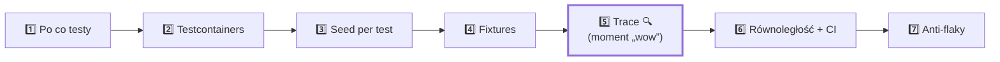

# Szkolenie: Testy integracyjne i E2E w TypeScript

**Testcontainers + Playwright — od zera do zielonego CI.**

Praktyczny program oparty o działający projekt [`sklep-e2e`](../README.md):
mały sklep (Express + PostgreSQL + Redis) z testami integracyjnymi
(Vitest + Testcontainers) i E2E (Playwright). Uczymy się na prawdziwym kodzie,
nie na slajdach.

> 🎞️ Towarzysząca prezentacja na żywo: https://ekunda.github.io/sklep-e2e/
> 🛒 Klikalne demo bez Dockera: `pnpm demo`
> 🧑‍🏫 Prowadzisz szkolenie? → [**Warsztat**](WARSZTAT.md) · [**Poradnik prowadzącego**](PORADNIK-PROWADZACEGO.md) · [**Karta A4 do druku**](KARTA-PROWADZACEGO.md)

---

## 🚦 Start w 3 minuty — wybierz swoją ścieżkę

```bash
corepack enable && pnpm install
pnpm exec playwright install chromium
```

| Masz... | Twoja ścieżka |
|---|---|
| 🐳 Dockera (lub 🐮 Rancher / 🦭 Podman) | pełny hands-on: `pnpm demo` + `pnpm test:integration` + `pnpm test:e2e` |
| 🏢 firmę bez licencji Docker Desktop | darmowy silnik (5 min setupu) → [**DOCKER-ALTERNATYWY.md**](DOCKER-ALTERNATYWY.md) |
| 💻 tylko Node, zero kontenerów | `pnpm demo` + czytanie kodu + zielone CI — przejdziesz ~80% materiału |

---

## 1. Wprowadzenie do szkolenia

### Dla kogo
Dla **mid developerów** i **QA automation**, którzy umieją pisać kod w
JS/TS i chcą nauczyć się testować aplikacje *tak, jak działają naprawdę* —
z prawdziwą bazą, a nie z mockami, które „udają”.

### Wymagania wstępne
- Podstawy **TypeScript** (typy, async/await, generyki w stopniu „czytam ze zrozumieniem”).
- Podstawy **SQL** (SELECT/INSERT/UPDATE).
- Zainstalowane: **Node 22.13+**, **pnpm** (`corepack enable`) i **silnik kontenerów**
  (do testów): Docker **albo darmowy Rancher Desktop / Podman** —
  patrz [DOCKER-ALTERNATYWY.md](DOCKER-ALTERNATYWY.md).
  Bez żadnego silnika przejdziesz 80% materiału przez `pnpm demo` i CI.

### Czego się nauczysz
- Kiedy pisać test **jednostkowy**, **integracyjny**, a kiedy **E2E**.
- Jak uruchomić **prawdziwą bazę w kontenerze** prosto z kodu testu (Testcontainers).
- Jak robić **seed per test**, żeby testy były niezależne i się nie „brudziły”.
- Jak budować **fixtures w Playwright** (logowanie, dane, izolacja).
- Jak debugować przez **trace** (czarna skrzynka testu).
- Jak to wszystko **zrównoleglić** i wpiąć w **CI**.
- Jak unikać **flaky tests**.

### Jaki problem to rozwiązuje
„U mnie działa, a na produkcji nie.” Testy z mockami przechodzą, bo mock mówi
„OK”. Prawdziwa baza powie „NIE” — bo złamałeś `UNIQUE`, bo typ się nie zgadza,
bo transakcja się nie cofnęła. To szkolenie uczy testować **wiernie**.

---

## 2. Ścieżka nauki (7 modułów)



| # | Moduł | Plik w repo |
|---|---|---|
| 1 | Po co testy E2E i integracyjne | — |
| 2 | Środowisko testowe z Testcontainers | [`tests/integration/global-setup.ts`](../tests/integration/global-setup.ts) |
| 3 | Zarządzanie danymi (seed per test) | [`tests/helpers/seed.ts`](../tests/helpers/seed.ts) |
| 4 | Architektura Playwright (fixtures) | [`tests/e2e/fixtures.ts`](../tests/e2e/fixtures.ts) |
| 5 | Debugowanie i trace | [`playwright.config.ts`](../playwright.config.ts) |
| 6 | Skalowanie (równoległość, CI) | [`.github/workflows/tests.yml`](../.github/workflows/tests.yml) |
| 7 | Dobre praktyki i antywzorce | — |

Każdy moduł ma ten sam rytm: **koncepcja po ludzku → przykład → zadanie →
częste błędy → do zapamiętania.**

---

## Moduł 1 — Po co testy E2E i integracyjne

### Koncepcja po ludzku
Wyobraź sobie, że budujesz samochód:
- **test jednostkowy** — sprawdzasz pojedynczą śrubkę,
- **test integracyjny** — sprawdzasz, czy silnik gada ze skrzynią biegów,
- **test E2E** — wsiadasz i jedziesz z A do B.

| Typ | Co testuje | Szybkość | Wierność |
|---|---|---|---|
| Jednostkowy | jedną funkcję | ⚡⚡⚡ | niska (izolacja) |
| Integracyjny | komponent + baza/cache | ⚡⚡ | **wysoka** |
| E2E | cały flow w przeglądarce | ⚡ | **najwyższa** |

**Mocki vs Testcontainers:** mock to atrapa, która zawsze mówi to, co zaprogramujesz.
Testcontainers uruchamia *prawdziwą* usługę w kontenerze. Mock testuje „czy zawołałem
funkcję”, Testcontainers testuje „czy to naprawdę zadziała”.

### Zadanie
Otwórz [`tests/integration/orders.test.ts`](../tests/integration/orders.test.ts).
Znajdź test, który sprawdza **rollback transakcji**. Zastanów się: czy mock
bazy byłby w stanie to udowodnić? (Nie — bo to zachowanie *prawdziwego* Postgresa).

### Częste błędy
- Testowanie wszystkiego przez E2E (wolne, kruche). Piramida: dużo integracyjnych, mało E2E.
- Mockowanie własnej bazy „bo szybciej”. Szybciej ≠ wiarygodniej.

### 🧠 Do zapamiętania
> Mock sprawdza **rozmowę**. Testcontainers sprawdza **rezultat**. Do bazy i cache —
> używaj prawdziwych usług w kontenerach.

### ✅ Sprawdź się
<details>
<summary>Test sprawdza, że <code>sendEmail()</code> zostało wywołane z dobrymi argumentami. Rozmowa czy rezultat?</summary>

**Rozmowa** — to mock. Nie wiesz, czy mail naprawdę by wyszedł; wiesz tylko, że
funkcja została zawołana. Dla *zewnętrznej* usługi (mailing) to OK — dla własnej
bazy już nie.
</details>

<details>
<summary>Test rollbacku transakcji — jednostkowy, integracyjny czy E2E? Dlaczego?</summary>

**Integracyjny.** Rollback to zachowanie *prawdziwego* Postgresa — mock bazy
„cofnie” transakcję tylko dlatego, że tak go zaprogramowałeś, więc niczego nie dowodzi.
</details>

---

## Moduł 2 — Środowisko testowe z Testcontainers

### Koncepcja po ludzku
Testcontainers to biblioteka, która mówi Dockerowi: „odpal mi Postgresa na czas
testów i daj adres”. Po testach kontener znika — zero śmieci, zero ręcznego
`docker compose`.

Cykl: **start kontenera → connection string → testy na prawdziwej bazie →
stop kontenera**.

### Przykład z repo
[`tests/integration/global-setup.ts`](../tests/integration/global-setup.ts) startuje
kontenery **raz** dla całego przebiegu:

```ts
const [pg, redis] = await Promise.all([
  new PostgreSqlContainer("postgres:16").start(),
  new GenericContainer("redis:7").withExposedPorts(6379).start(),
]);
provide("databaseUrl", pg.getConnectionUri());
provide("redisUrl", `redis://${redis.getHost()}:${redis.getMappedPort(6379)}`);
```

### ⚠️ Pułapka, która kosztuje godziny (Vitest)
`process.env` ustawione w global-setup **nie dociera** do workerów testowych.
Dlatego używamy `provide()` (w setupie) i `inject()` (w teście) — to typowany kanał:

```ts
// vitest: rozszerz typ, żeby inject() był bezpieczny
declare module "vitest" {
  export interface ProvidedContext {
    databaseUrl: string;
    redisUrl: string;
  }
}
// w teście:
const databaseUrl = inject("databaseUrl"); // typ: string
```

### 💡 Ulepszenie: poziom kontenera = poziom izolacji vs szybkości
- **Global** (nasze podejście) — najszybsze, jeden kontener na cały przebieg.
- **Per plik (`beforeAll`)** — większa izolacja, wolniejsze.
- **Per worker** — złoty środek przy dużej równoległości (patrz Moduł 6).

### Zadanie
Dodaj kontener **MailHog** (`mailhog/mailhog`) do global-setup i `provide`
jego URL. Cel: ćwiczysz `GenericContainer` + `withExposedPorts`.

### Częste błędy
- Restart kontenera w `afterEach` — każdy restart to sekundy. Współdziel + czyść dane.
- Za krótki timeout pierwszego startu (pobranie obrazu). Ustaw `hookTimeout: 120_000`.

### 🧠 Do zapamiętania
> Kontener startuj **raz**, dane czyść **przed każdym testem**. W Vitest przekazuj
> connection stringi przez `provide`/`inject`, nie przez `process.env`.

### ✅ Sprawdź się
<details>
<summary>Czemu <code>process.env.DATABASE_URL = ...</code> w global-setup nie działa w testach?</summary>

Workery Vitest to **osobne procesy** — nie dziedziczą zmian w `process.env`
zrobionych w setupie. Kanałem jest `provide()` (setup) → `inject()` (test).
</details>

<details>
<summary>Pierwszy test wisi 60 sekund i pada na timeout. Co się najpewniej dzieje?</summary>

Silnik **pobiera obraz** (postgres:16) przy pierwszym starcie. Rozgrzej obrazy
przed sesją (`docker pull`) i ustaw `hookTimeout: 120_000`.
</details>

---

## Moduł 3 — Zarządzanie danymi (seed per test)

### Koncepcja po ludzku
**Seed** to „zasiew” — wstawiasz dane potrzebne do tego konkretnego testu.
Zasada: **każdy test sieje własne dane**. Globalny seed dla wszystkich = jeden
test psuje drugi.

### Przykład z repo
[`tests/helpers/seed.ts`](../tests/helpers/seed.ts) — helper z wartościami
domyślnymi, zwraca to, czego potrzebują asercje (w tym hasło plain-text):

```ts
export async function seedUser(pool: Pool, options: SeedUserOptions = {}): Promise<SeededUser> {
  const opts = { email: `user-${++c}@test.com`, password: "Password123!", ...options };
  const hash = await hashPassword(opts.password);
  const r = await pool.query(
    `INSERT INTO users (email, name, password_hash, role)
     VALUES ($1, $2, $3, $4) RETURNING id, email, name, role`,
    [opts.email, opts.name, hash, opts.role],
  );
  return { ...r.rows[0], password: opts.password };
}
```

### 💡 Ulepszenie: typowane fabryki (Factory / Builder)
Gdy danych przybywa, warto przejść z luźnych helperów na **typowane fabryki** —
spójny kontrakt, świetne podpowiedzi w IDE, łatwe powiązania (user → order):

```ts
// tests/helpers/factories.ts
import type { Pool } from "pg";

export interface UserRow { id: number; email: string; name: string; role: "user" | "admin"; }

interface UserFactory {
  build(overrides?: Partial<Omit<UserRow, "id">> & { password?: string }): Promise<UserRow & { password: string }>;
}

export function userFactory(pool: Pool): UserFactory {
  let seq = 0;
  return {
    async build(overrides = {}) {
      const data = {
        email: overrides.email ?? `user-${++seq}-${Date.now()}@test.com`,
        name: overrides.name ?? "Test User",
        role: overrides.role ?? "user",
        password: overrides.password ?? "Password123!",
      };
      const hash = await hashPassword(data.password);
      const { rows } = await pool.query<UserRow>(
        `INSERT INTO users (email, name, password_hash, role)
         VALUES ($1, $2, $3, $4) RETURNING id, email, name, role`,
        [data.email, data.name, hash, data.role],
      );
      return { ...rows[0], password: data.password };
    },
  };
}
```

Użycie czyta się jak zdanie: `await userFactory(pool).build({ role: "admin" })`.

### Izolacja: czyść przed każdym testem
[`tests/helpers/db-cleaner.ts`](../tests/helpers/db-cleaner.ts):

```ts
await pool.query(
  `TRUNCATE TABLE order_items, orders, products, users RESTART IDENTITY CASCADE`,
);
```
`TRUNCATE` jest szybki, `RESTART IDENTITY` zeruje sekwencje, `CASCADE` ogarnia FK.

### Zadanie
Dopisz `orderFactory(pool)`, które tworzy zamówienie powiązane z `userId`
i listą `{ productId, quantity }`. Zwróć `orderId` i `total`.

### Częste błędy
- Poleganie na `id = 1`. Sekwencje nie resetują się między testami — używaj id ze zwrotki.
- Współdzielony email między testami → duplikat → flaky. Generuj unikalne dane.

### 🧠 Do zapamiętania
> Każdy test: **arrange (seed) → act → assert**, na **czystej** bazie. Nie zakładaj `id = 1`.

### ✅ Sprawdź się
<details>
<summary>Test A i test B używają <code>email: "test@test.com"</code>. Pojedynczo przechodzą, razem padają. Czemu?</summary>

Drugi `INSERT` łamie **UNIQUE** na emailu — dane z testu A „przeciekły” do B.
Lekarstwo: czysta baza w `beforeEach` + unikalne dane z seedera.
</details>

<details>
<summary>Co robi <code>TRUNCATE ... RESTART IDENTITY CASCADE</code> i czemu nie zwykły <code>DELETE</code>?</summary>

`TRUNCATE` jest szybszy od `DELETE`, `RESTART IDENTITY` zeruje sekwencje id,
`CASCADE` czyści też tabele powiązane kluczami obcymi — jedna komenda, czysty stan.
</details>

---

## Moduł 4 — Architektura Playwright (fixtures)

### Koncepcja po ludzku
**Fixture** to gotowy element, który Playwright „podaje” do testu. `page` to też
fixture. Własne fixtures rozwiązują problem: *„jak nie powtarzać setupu w 50 testach?”*.

### Przykład z repo
[`tests/e2e/fixtures.ts`](../tests/e2e/fixtures.ts) — świeży user + produkt
(seed per test) i strona z gotowym logowaniem:

```ts
export const test = base.extend<Fixtures>({
  testUser: async ({ request }, use) => {
    const res = await request.post("/api/test/seed-user", { data: { email, password } });
    const user = await res.json();
    await use(user);
    await request.delete(`/api/test/cleanup-user/${user.id}`); // teardown
  },
  authedPage: async ({ page, testUser }, use) => {
    await page.goto("/");
    await page.evaluate((t) => localStorage.setItem("auth_token", t), testUser.token);
    await use(page); // logowanie przez API = dużo szybciej niż przez UI
  },
});
```

### 💡 Ulepszenie 1: typowany klient API zamiast „magicznych stringów”
Zamiast wklejać `"/api/test/seed-user"` w wielu miejscach, opakuj API w typowany
helper — jedno miejsce prawdy, autouzupełnianie, łatwa zmiana:

```ts
// tests/e2e/api-client.ts
import type { APIRequestContext } from "@playwright/test";

export interface SeededUser { id: number; email: string; token: string; }

export class TestApi {
  constructor(private readonly request: APIRequestContext) {}

  async seedUser(data: { email: string; password: string; name?: string }): Promise<SeededUser> {
    const res = await this.request.post("/api/test/seed-user", { data });
    if (!res.ok()) throw new Error(`seedUser failed: ${res.status()} ${await res.text()}`);
    return res.json();
  }

  async cleanupUser(id: number): Promise<void> {
    await this.request.delete(`/api/test/cleanup-user/${id}`);
  }
}
```

```ts
// fixture korzysta z klienta — czytelnie i bezpiecznie typowo
api: async ({ request }, use) => { await use(new TestApi(request)); },
testUser: async ({ api }, use) => {
  const user = await api.seedUser({ email: uniqueEmail(), password: "E2EPass123!" });
  await use(user);
  await api.cleanupUser(user.id);
},
```

### 💡 Ulepszenie 2: `mergeTests` — komponuj fixtures z wielu plików
Gdy fixtures rośnie, rozbij na pliki tematyczne i złóż:

```ts
import { mergeTests } from "@playwright/test";
import { test as authTest } from "./fixtures/auth";
import { test as dataTest } from "./fixtures/data";

export const test = mergeTests(authTest, dataTest);
export { expect } from "@playwright/test";
```

### 💡 Ulepszenie 3: `test.step` — czytelny przepływ i lepszy trace
Krok w teście = czytelna nazwa w raporcie i w Trace Viewerze:

```ts
test("zakup", async ({ authedPage, testProduct }) => {
  await test.step("dodaj do koszyka", async () => {
    await authedPage.getByTestId(`product-${testProduct.id}`)
      .getByRole("button", { name: "Dodaj do koszyka" }).click();
  });
  await test.step("złóż zamówienie", async () => { /* ... */ });
});
```

### Zadanie
Przerób `fixtures.ts` tak, by używał `TestApi`. Dodaj fixture `adminPage`
(zalogowany admin) przez `api.seedUser({ role: "admin" })`.

### Częste błędy
- Logowanie przez UI w każdym teście (2-3 s straty). Loguj przez API + token w storage.
- Brak teardownu w fixture → dane zostają → flaky. Sprzątaj po `await use(...)`.
- Import `test` z `@playwright/test` zamiast z własnego `fixtures.ts`.

### 🧠 Do zapamiętania
> Setup, który powtarzasz → przenieś do **fixture**. Loguj przez **API**. Sprzątaj
> w **teardownie**. Stringi do API zamknij w **typowanym kliencie**.

### ✅ Sprawdź się
<details>
<summary>50 testów loguje się przez formularz UI. Ile czasu tracisz i co z tym zrobić?</summary>

~2-3 s × 50 = **dwie minuty** na sam login. Loguj przez API (token do
`localStorage` w fixture `authedPage`) — formularz logowania testujesz **raz**, osobnym testem.
</details>

<details>
<summary>W którym miejscu fixture wykonuje się teardown (sprzątanie)?</summary>

Wszystko **po `await use(...)`** — to odpowiednik `afterEach`, ale trzymany razem
z setupem. Brak teardownu = dane zostają = flaky.
</details>

---

## Moduł 5 — Debugowanie i trace artifacts

### Koncepcja po ludzku
**Trace** to czarna skrzynka samolotu — nagrywa wszystko: timeline akcji,
screenshoty, sieć (HTTP), konsolę, drzewo DOM. Po wywrotce otwierasz i widzisz
*dokładnie* gdzie i czemu pękło.

### Konfiguracja (kiedy i po co)
[`playwright.config.ts`](../playwright.config.ts):

```ts
use: {
  trace: "on-first-retry",     // pełny zapis tylko przy 1. powtórce nieudanego testu
  screenshot: "only-on-failure",
  video: "retain-on-failure",
}
```

| Tryb trace | Kiedy używać |
|---|---|
| `on` | lokalne, ostre debugowanie (dużo danych) |
| `on-first-retry` | **CI** — zapis tylko gdy test pada i jest powtarzany |
| `retain-on-failure` | gdy nie używasz retry, a chcesz trace przy każdej porażce |
| `off` | nigdy w CI bez powodu |

### Jak czytać trace
```bash
pnpm exec playwright show-report            # raport z osadzonym trace
pnpm exec playwright show-trace trace.zip   # konkretny plik
```
Nawyki:
1. **Czerwona akcja** → gdzie pękło.
2. **Call / Log** → dlaczego (timeout vs zła liczba elementów vs brak).
3. **Network** → wina backendu czy UI?
4. **Console** → błędy JS frontu.

### Zadanie
Zepsuj celowo jeden selektor w teście E2E, uruchom z `--trace on`, otwórz trace
i przejdź ścieżkę „czerwona akcja → Network → Console”. Napraw.

### Częste błędy
- `trace: "on"` w CI → góra danych. Użyj `on-first-retry`.
- Debugowanie przez `console.log` zamiast trace. Trace pokazuje *stan strony*, nie tylko logi.

### 🧠 Do zapamiętania
> W CI: `retries: 2` + `trace: "on-first-retry"`. Test pada → masz czarną skrzynkę.
> Test przechodzi po retry → masz kandydata na flaky do zbadania.

### ✅ Sprawdź się
<details>
<summary>Test padł na kliknięciu, w zakładce Network widzisz <code>500</code> na <code>/api/orders</code>. Wina UI czy backendu?</summary>

**Backendu** — UI nie miał czego wyrenderować. Bez trace'a debugowałbyś selektory;
z trace'em od razu wiesz, że trzeba patrzeć w API.
</details>

<details>
<summary>W Logu czerwonej akcji: „locator resolved to 0 elements". Co to znaczy?</summary>

Element **nie istnieje** (zły selektor / inna nazwa przycisku) — to nie „wolna
strona". Timeout z 0 elementów = szukaj literówki, nie zwiększaj timeoutu.
</details>

---

## Moduł 6 — Skalowanie (równoległość i CI)

### Koncepcja po ludzku
Jeden test = sekundy. Tysiąc = minuty, jeśli równolegle. Klucz: **izolacja**
(żeby testy nie deptały sobie danych) + **podział pracy** (workery, shardy).

### Playwright: równoległość
```ts
export default defineConfig({
  fullyParallel: true,         // każdy test = świeży kontekst przeglądarki
  workers: process.env.CI ? 2 : undefined,
  retries: process.env.CI ? 2 : 0,
});
```

### Vitest: ostrożnie ze współdzieloną bazą
W repo: `fileParallelism: false` — pliki integracyjne dzielą **jeden** kontener,
więc czyszczenie bazy w jednym pliku nie może ścigać się z drugim.

### 💡 Ulepszenie: kontener **per worker** (skalowanie integracyjnych)
Zamiast jednego kontenera + sekwencyjnych plików — każdy worker dostaje własny
kontener i bazę. Wtedy pliki mogą biec równolegle:

```ts
// vitest: kontener per worker (uproszczony szkic)
import { beforeAll, afterAll, inject } from "vitest";
let pool: Pool;
beforeAll(async () => {
  const pg = await new PostgreSqlContainer("postgres:16").start();
  pool = createPool(pg.getConnectionUri());
  await runMigrations(pool);
  // ...udostępnij pool testom w tym pliku/workerze...
});
```
Trade-off: więcej RAM/CPU, ale liniowe przyspieszenie. Wybierz świadomie.

### CI: sharding (Playwright) — patrz [`tests.yml`](../.github/workflows/tests.yml)
```yaml
strategy:
  matrix:
    shard: [1, 2]
- run: pnpm exec playwright test --shard=${{ matrix.shard }}/2
```
Docker jest preinstalowany na `ubuntu-latest` — Testcontainers działają od ręki.
Artefakty (raport, trace) wgrywamy `if: always()` / `if: failure()`.

### Zadanie
Zmień sharding z 2 na 3 maszyny. Sprawdź w Actions, że czas spada, a sumaryczna
liczba testów się zgadza.

### Częste błędy
- `fullyParallel` + współdzielone dane bez izolacji → losowe porażki.
- Brak `cache: pnpm` w setup-node → wolniejsze CI.

### 🧠 Do zapamiętania
> Równoległość bez izolacji = flaky. Najpierw **izoluj dane** (czysta baza /
> unikalne dane / kontener per worker), potem **zwiększaj workery i shardy**.

### ✅ Sprawdź się
<details>
<summary>Czemu w tym repo testy integracyjne mają <code>fileParallelism: false</code>?</summary>

Wszystkie pliki dzielą **jeden** kontener — gdyby biegły równolegle, `TRUNCATE`
z jednego pliku kasowałby dane testu z drugiego. Chcesz równoległości? Kontener per worker.
</details>

<details>
<summary>Po włączeniu <code>fullyParallel</code> testy padają „losowo". Pierwsze podejrzenie?</summary>

**Współdzielone dane** bez izolacji — dwa testy depczą sobie po stanie. Równoległość
nie psuje testów, tylko **ujawnia** brak izolacji.
</details>

---

## Moduł 7 — Dobre praktyki i antywzorce

### Determinizm i izolacja
- ✅ `await expect(locator).toHaveText(...)` (auto-wait) — ❌ `expect(await locator.textContent())`.
- ✅ czysta baza w `beforeEach` — ❌ poleganie na danych z poprzedniego testu.
- ✅ unikalne dane (timestamp/uuid) — ❌ `email = "test@test.com"` współdzielony.

### Anty-flaky checklist
- [ ] Zero `waitForTimeout()` (poza chwilowym debugiem).
- [ ] Web-first assertions (`toBeVisible`, `toHaveCount`, `toHaveURL`).
- [ ] Czekaj na response API przed asercją UI, gdy trzeba: `await page.waitForResponse(...)`.
- [ ] **Mockuj zewnętrzne** API (nie swoje!) przez `page.route`:

```ts
await page.route("**/api.kursy.example/**", (route) =>
  route.fulfill({ status: 200, body: JSON.stringify({ USD: 4.05 }) }),
);
```
- [ ] Uruchom 10× lokalnie: `pnpm exec playwright test --repeat-each=10`.

### TypeScript w architekturze
- Typuj zwroty fabryk i fixtures (mniej `any`, więcej podpowiedzi).
- Rozszerzaj typy frameworka (`ProvidedContext` w Vitest, `Fixtures` w Playwright).
- Trzymaj kontrakty API testowego w jednym pliku (`api-client.ts`).
- `strict: true` + `noUncheckedIndexedAccess` w `tsconfig` (jest w repo).

### 🧠 Do zapamiętania
> Stabilny test to **deterministyczny** test: auto-wait, izolacja danych,
> mock tylko tego, czego nie kontrolujesz.

### ✅ Sprawdź się
<details>
<summary>Co jest nie tak z <code>expect(await locator.textContent()).toBe("OK")</code>?</summary>

Odczyt jest **natychmiastowy** — brak auto-wait. Na wolnym CI tekst jeszcze nie
istnieje i test pada. `await expect(locator).toHaveText("OK")` czeka sam.
</details>

<details>
<summary>Kiedy w teście E2E wolno mockować (<code>page.route</code>)?</summary>

Tylko **zewnętrzne** API, których nie kontrolujesz (kursy walut, bramka płatności).
Własnej bazy i własnego API — nigdy: po to są kontenery.
</details>

---

## 3. Propozycja refaktoryzacji repozytorium

Repo jest spójne, ale przy rozroście warto:

### Lepsza struktura `tests/`
```
tests/
  support/                 # cała "infrastruktura" testowa
    containers.ts          # tworzenie kontenerów (PG, Redis) w jednym miejscu
    test-app.ts            # budowa aplikacji pod testy
    db-cleaner.ts
  factories/               # typowane fabryki danych (zamiast luźnego seed.ts)
    user.factory.ts
    product.factory.ts
    order.factory.ts
  integration/
    setup/global-setup.ts
    auth.spec.ts           # ujednolić rozszerzenie: .spec.ts wszędzie
    orders.spec.ts
  e2e/
    fixtures/
      auth.fixture.ts
      data.fixture.ts
      index.ts             # mergeTests -> jeden `test`
    api-client.ts
    auth.spec.ts
    shopping.spec.ts
    setup/global-setup.ts
```

### Zasady
- **Jedno miejsce na logikę kontenerów** (`support/containers.ts`) — nie kopiuj
  `new PostgreSqlContainer(...)` w integracji i E2E.
- **Fabryki zamiast helperów** — typowany kontrakt, łatwe powiązania.
- **Spójne nazewnictwo** — wszędzie `*.spec.ts`; pliki fixture jako `*.fixture.ts`.
- **Podział odpowiedzialności:** *setup* (kontenery, app) ≠ *dane* (fabryki) ≠
  *scenariusze* (spec) ≠ *kontrakty* (api-client, typy).
- **TS:** wspólne typy encji (`UserRow`, `ProductRow`) w `tests/support/types.ts`
  i reużycie w fabrykach i asercjach.

### Gdzie ma być logika Testcontainers
W `tests/support/containers.ts` jako funkcje zwracające „uruchomiony + URL”:
```ts
export async function startPostgres() {
  const c = await new PostgreSqlContainer("postgres:16").start();
  return { container: c, url: c.getConnectionUri() };
}
```
Global-setup tylko *komponuje* te klocki. Mniej duplikacji, łatwiej testować.

---

## 4. Ulepszenia kodu (skrót)
Pełne przykłady są w modułach 3–4 powyżej:
- **Typowane fabryki** danych (Moduł 3) — zamiast luźnych `seedX`.
- **`TestApi`** — typowany klient tras testowych (Moduł 4).
- **`mergeTests`** + pliki `*.fixture.ts` (Moduł 4).
- **`test.step`** dla czytelności i trace (Moduł 4).
- **Kontener per worker** dla skalowania integracyjnych (Moduł 6).

---

## 5. Dobre praktyki (ściąga)
- **Determinizm:** auto-wait, zero hardcoded sleepów.
- **Izolacja:** czysta baza per test / unikalne dane / kontener per worker.
- **Dane testowe:** seed per test, fabryki, teardown.
- **Debug:** `trace: on-first-retry`, `show-trace`, czytaj Network + Console.
- **CI/CD:** Docker preinstalowany, sharding, artefakty `if: always()`.
- **TypeScript:** typuj fixtures/fabryki, rozszerzaj typy frameworka, `strict`.

---

## 6. Wersja warsztatowa

Dwa formaty do wyboru:
- 🧑‍🏫 **[Warsztat — wersja prowadzona](WARSZTAT.md)** — pokaz + zrozumienie + „wow” na trace. Jak poprowadzić → [Poradnik prowadzącego](PORADNIK-PROWADZACEGO.md).
- 🛠️ **Pełny hands-on** — poniżej, z zadaniami i checkpointami.

### Pełny hands-on

| Blok | Hands-on | Checkpoint ✅ |
|---|---|---|
| Start: klon + `pnpm install` + `pnpm demo` | uruchom sklep bez Dockera | widzę sklep w przeglądarce |
| M1 koncepcje | wskaż test rollbacku | rozumiem mock vs TC |
| M2 Testcontainers | dodaj kontener MailHog | `provide/inject` działa |
| M3 seed/fabryki | napisz `orderFactory` | test izolowany przechodzi |
| M4 fixtures | wprowadź `TestApi` + `adminPage` | E2E loguje przez API |
| M5 trace | zepsuj selektor, czytaj trace | znajduję błąd w trace |
| M6 CI/skalowanie | sharding 2→3 | zielony pipeline |
| M7 anti-flaky | `--repeat-each=10` | 10/10 przejść |

**Ćwiczenia dodatkowe (dla chętnych):**
1. Dodaj endpoint + test integracyjny „anuluj zamówienie” (status → `cancelled`).
2. Zamockuj zewnętrzną bramkę płatności w E2E (`page.route`).
3. Dodaj `test.step` do flow zakupowego i porównaj raport.

---

## 7. Sekcja zaawansowana

### Równoległe testy z kontenerami
- **Per worker** (integracyjne): liniowe przyspieszenie kosztem RAM.
- **Reuse** w devie: `.withReuse()` + `testcontainers.reuse.enable=true` — kontener
  przeżywa restart testów (szybsza pętla lokalna; **nie** używaj w CI).

### Wydajność
- Loguj przez API, nie UI (oszczędność 2-3 s/test).
- `storageState` — zaloguj raz, użyj w wielu testach (projekt `setup` + `dependencies`).
- Cache pnpm i obrazów w CI; pobieraj tylko `chromium` (`--with-deps chromium`).

### Flaky tests — jak eliminować
1. **Powtórz** podejrzany test 10-20×, izoluj.
2. **Trace** z nieudanego przebiegu — czy to race condition (UI przed danymi)?
3. **Web-first assertions** zamiast ręcznych odczytów.
4. **Czekaj na sygnał**, nie na czas (`waitForResponse`, `toBeVisible`).
5. **Izoluj dane** — najczęstsza przyczyna „czasem przechodzi”.

### Skalowanie w CI
- Sharding Playwright (`--shard=i/N`) + `fail-fast: false`.
- Osobne joby: szybkie integracyjne jako „gate”, E2E `needs: integration`.
- Reporter `github` → wyniki jako adnotacje w PR.
- Trace/wideo wgrywaj `if: failure()`, raport `if: always()`.

---

## Jak korzystać z tego repo na szkoleniu
```bash
corepack enable
pnpm install
pnpm demo                 # sklep na żywo bez kontenerów (do klikania)
pnpm test:integration     # wymaga silnika kontenerów
pnpm test:e2e             # wymaga silnika kontenerów + chromium
pnpm exec playwright show-report
```
Silnik kontenerów = Docker **lub darmowy Rancher Desktop / Podman**
([DOCKER-ALTERNATYWY.md](DOCKER-ALTERNATYWY.md)). Bez żadnego silnika: czytaj kod,
używaj `pnpm demo`, oglądaj zielone CI i artefakty trace.

> **Złota zasada szkolenia:** nie wdrażaj wszystkiego naraz. Zacznij od **jednego**
> testu integracyjnego z Testcontainers i **jednego** E2E z fixture. Lepiej mieć
> 5 stabilnych testów niż 50 flaky.
